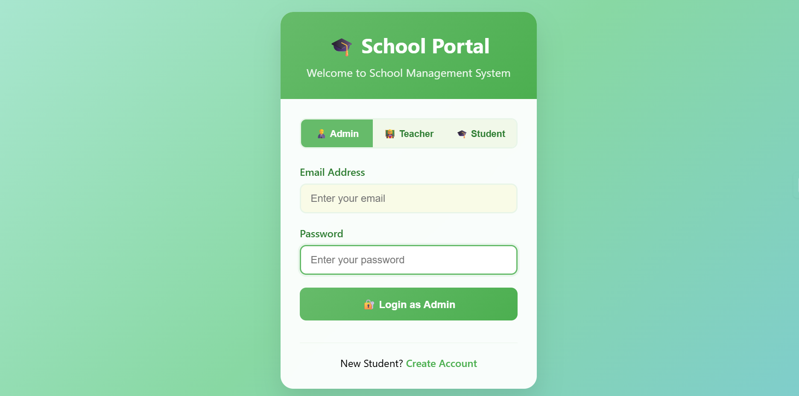
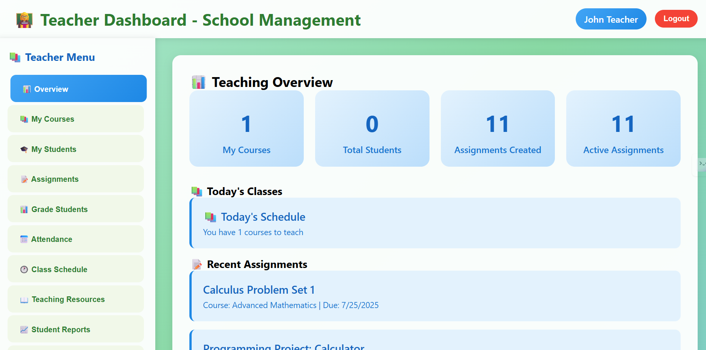
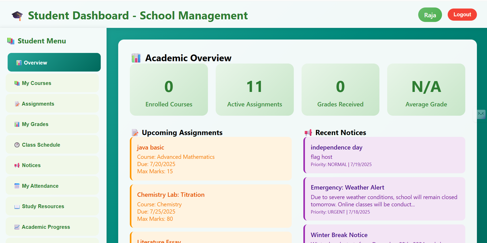

# 🎓 School Management System – Spring Boot + IntelliJ IDEA

A fully functional School Management System built with Java, Spring Boot, and MySQL, featuring a clean architecture, intuitive UI, and role-based access control.

---

## 🚀 Key Features

- ✅ **Role-Based Access** – Separate dashboards for Admin, Faculty, and Students  
- ✅ **File Upload System** – With progress tracking and status updates  
- ✅ **Responsive UI** – Works on desktop, tablet, and mobile  
- ✅ **Real-Time Data Handling** – Manual refresh capability for updated data  
- ✅ **Complete CRUD Operations** – Manage students, faculty, courses, and more  
- ✅ **Clean, Modular Codebase** – Follows Spring Boot best practices  
- ✅ **Optimized for IntelliJ IDEA** – Smooth local development experience  

---

## 🛠️ Tech Stack

| Category        | Technology          |
|----------------|---------------------|
| Backend         | Java, Spring Boot   |
| Database        | MySQL               |
| IDE             | IntelliJ IDEA       |
| Build Tool      | Maven               |
| Version Control | Git                 |
| API Testing     | Postman             |

---


## 💻 Getting Started (Local Setup)

### 1. Clone the Repository

```bash
git clone https://github.com/varun-1729/school-management-system.git
2. Open the Project
Open the project in IntelliJ IDEA (or your preferred IDE)

3. Configure Database Credentials in application.properties
spring.datasource.url=jdbc:mysql://localhost:3306/your_db_name  
spring.datasource.username=your_username  
spring.datasource.password=your_password
4. Build & Run the Project
mvn spring-boot:run
```
## 📸 Screenshots

### 🔐 Login Page


### 👩‍🏫 Teacher Dashboard


### 🎓 Student Dashboard


### 👨‍💼 Admin Dashboard


## 👤 Author

**Developed with ❤️ by Varun Koushik**  
📧 **Email:** [palagani.varun2004@gmail.com](mailto:palagani.varun2004@gmail.com)  
💻 **GitHub:** [@varun-1729](https://github.com/varun-1729)  
💼 **LinkedIn:** [linkedin.com/in/varun-koushik-a74a1b28a](https://linkedin.com/in/varun-koushik-a74a1b28a)

